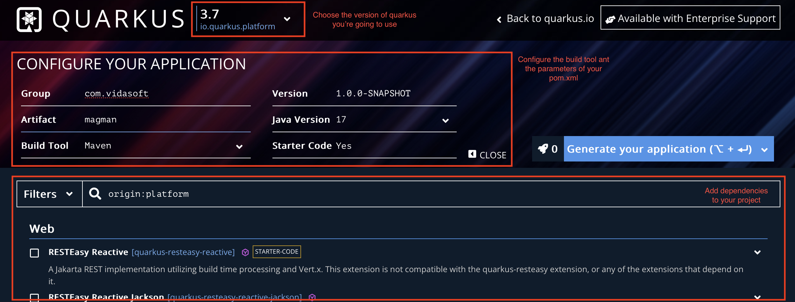
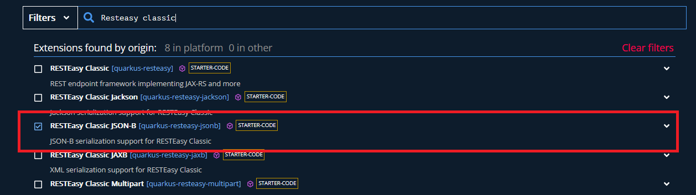
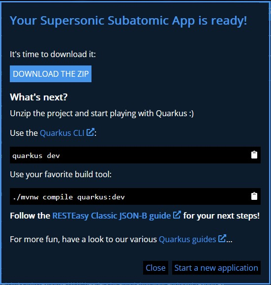
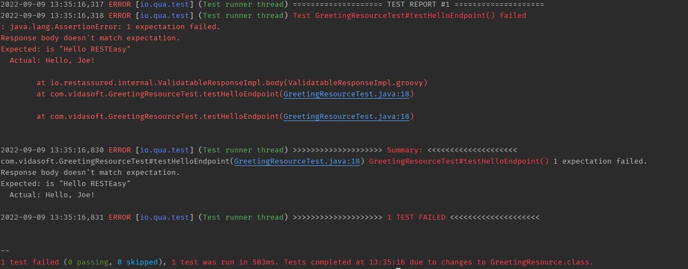
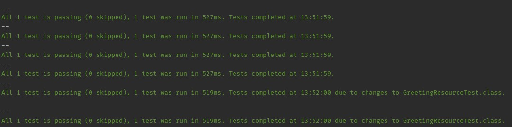
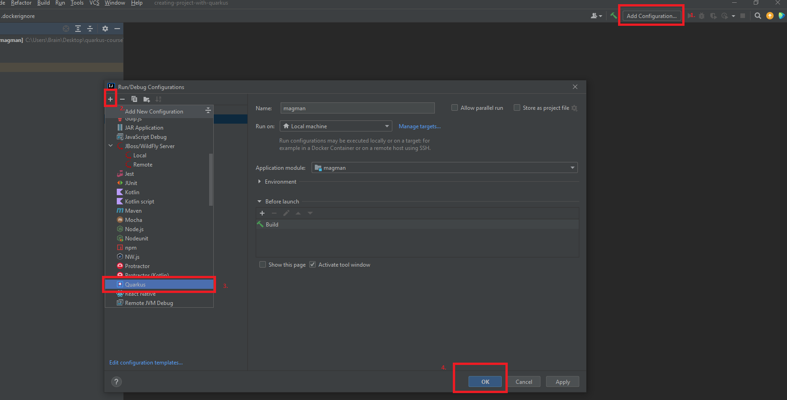
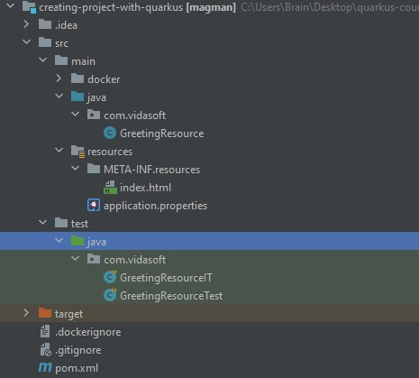

== Introduction to Quarkus, project setup and structure, developer experience

=== Introduction to Quarkus

==== What is Quarkus?

> Traditional Java stacks were engineered for monolithic applications with long startup times and large memory requirements in a world where the cloud, containers, and Kubernetes did not exist. Java frameworks needed to evolve to meet the needs of this new world.
 +
Quarkus was created to enable Java developers to create applications for a modern, cloud-native world. Quarkus is a Kubernetes-native Java framework tailored for GraalVM and HotSpot, crafted from best-of-breed Java libraries and standards. The goal is to make Java the leading platform in Kubernetes and serverless environments while offering developers a framework to address a wider range of distributed application architectures. - "What is Quarkus?", https://quarkus.io/about/

In other words Quarkus is a Java application server, that implements its own version of the Java EE spec, and provides the most modern and up-to-date capabilities to help Java and Java EE catch up with the latest technologies and standards.
Unlike traditional Java application servers, Quarkus is lightweight, it has a small consumptional fingerprint on the system, and it starts up runs blazingly fast.
These features allow for more scalable applications, less powerful hardware and serverless applications to be created and used.
As a result development becomes easier, deployment becomes faster and costs become lower.

Here are some good points to use Quarkus:

- It implements most of the Jakarta EE and MicroProfile specifications - with Quarkus you have most of the Java / Jakarta EE specs provided, along wih MicroProfile, you're getting the most out of the up to date technologies to implement modern web applications.
- Fast startup time and low memory footprint - a Quarkus project includes only the stuff you need and use in your project.
Implementations are also deeply optimized to give you the best performance for your application.
- Native mode - in combination with Graal VM, you can build native AOT applications with Quarkus.
This allows even smaller memory footprint, even quicker startup time (under a second).
- Great developer experience - Quarkus allows you to test and develop, while your app is running, similar to Node.js.
You need to change something? No need to restart the server and wait to redeploy again. 
Simply refresh the page, or give it another REST call and the app will redeploy automatically.

TIP: You can read more about Quarkus' performance https://quarkus.io/blog/runtime-performance/[here].

==== What is this course about?

This course will walk you through the basics of Java/Jakarta EE using the Quarkus development framework.
We will wall you through the most modern and up to date specs of Jakarta EE and how to develop your applications with Quarkus.
At the end, you should have the common knowledge to write your own applications or be able to understand other applications and get involved with your team project easily.

== Creating your first application with Quarkus

Now that you know what Java/Jakarta EE and Quarkus is, it is time to create our own Quarkus application.
This section will give you a quick start, showing you the ways you can create and run your a Quarkus project.
Next lessons will aim to extend that application, with intent to upgrade your knowledge and understandings.
At the end you will have a functioning example of all important Java EE specs implemented into this project.

=== The https://code.quarkus.io[code.quarkus.io] approach

Starting on a new project?
It can always get a bit frustrating, having to configure your environment and deal with all the specific configurations and XMLs within your project.
Don't worry though, Quarkus has you covered.
All you need to do is go to https://code.quarkus.io.
There you will find simple and easy project generator, that will help you to set the name of the project and your package domain (group and artifact id)

The interface is quite easy to use and understand.
You can choose the version of Quarkus, the group and artifact id of your application, the version of the JDK of your application, as well as the version of your application.

Finally you are able to decide which build tool to use (either `Maven`, `Gradle` or `Gradle with Kotlin DSL`), and whether you want any "Starter code" generated or a blank project.
After that you are welcomed with a list of Quarkus Extensions you are able to choose for your generated project.
These can be extended, removed, depending on your needs.
More of that, you'll find in our next lessons.

==== Creating your first project

For the sake of ease, you can follow the configurations as shown above.
Then add the following extension to your project:

RestEasy with JSON-B are that are the first libraries that we are going to use, in order to look through our first Java EE specification - JAX-RS.

Once you have checked this extension, go and click the `Generate your application button`.
A modal window will give you the different ways you can obtain your project.

Following the instructions, there will be three options:

. Directly download the generated project tree, zipped.
. Use the https://quarkus.io/guides/cli-tooling[Quarkus CLI]
. Use maven

If you want to go pro, you can try and create your application using the Quarkus CLI or maven.

=== Creating your app with Quarkus CLI

Quarkus has provided a convenient command line interface, that allows easy interactions with your project configuration, so you can create, personalize and modify your Quarkus extensions in a jiffy.
If you feel more experienced with terminals and command lines, this would be a better approach for you to quickly generate your project.

To generate a project with Quarkus CLI, simply execute the following code:

[source,cli]
----
quarkus create app com.vidasoft:magman \
    --extension=quarkus-resteasy-jsonb
----

=== Creating your app with Maven

A more verbose approach to generate your first Quarkus application would be by using Maven.
To achieve the same result, you can simply execute the following line:

[source,cli]
----
mvn io.quarkus.platform:quarkus-maven-plugin:3.7.1.Final:create \
    -DprojectGroupId=com.vidasoft \
    -DprojectArtifactId=magman \
    -Dextensions="quarkus-resteasy-jsonb"
----

TIP: To view more possibilities to generate and personalize your Quarkus project, please visit https://quarkus.io/guides/rest-json

=== Let's start your project.

==== What do we need to get started?

* Java 17 or greater
* Maven 3.9.3 or greater
* A computer with internet connection

TIP: If you want to work with Quarkus CLI, you would need to install it first.
Read https://quarkus.io/guides/cli-tooling[this article] to learn more.

Now that you have the project created, let's see it running.
To run your code, simply execute `mvn quarkus:dev`.

image::img/quarkus-dev-start.jpg[align=center]

Once you see this in the command line, you can be assured your application is up and running.

Now let's test that, shall we?

Execute the following cURL:

[source,curl]
----
curl --location --request GET "localhost:8080/hello"
----

You should be greeted with the following response:

[source,text]
----
Hello RESTEasy
----

=== Developing with Quarkus during runtime

One of the cool things about Quarkus is that you can develop your applications and run tests while the application is still running.
Let's put that in test.

Start up your Quarkus application if you haven't already.
Then let's call our REST endpoint to make sure it's working again.

[source,curl]
----
curl --location --request GET "localhost:8080/hello"
----

Now let's try and change the response.
Go to `src\main\java\com\vidasoft\GreetingResource.java` and edit the return String.
Change the message to something else.

[source,java]
----
...
return "Hello, Joe";
...
----

Now curl rhe endpoint again.
Did it work?
You should be seeing the new response in your console.

==== Running tests in runtime

The startup project comes with a test for the hello endpoint built in.
Let's try and run that test while the app is running.
Press `r` inside the window where your project is running.

If you followed the previous section, the test should fail.

Now let's fix that and let the test pass.
Go to `src\test\java\com\vidasoft\GreetingResourceTest.java` and change the expected message to the new response you have set.

[source,java]
----
    @Test
    public void testHelloEndpoint() {
        given()
          .when().get("/hello")
          .then()
             .statusCode(200)
             .body(is("Hello, Joe!"));
    }
----

Press `r` in the application's window again, and observe the results.

== Project structure with Quarkus and Maven

Now that we have successfully created our project, let's get to know its structure, so we can comfortably know our way around.

=== Configuring your IDE for the project

Since we are working with abstract and sophisticated matter, let's first load our project into our IDE.
All Java IDEs are supporting the Java/Jakarta EE annotations, and most popular ones such as IntelliJ IDEA and Eclipse support the Quarkus framework out of the box, which means the IDE will know how to set up your environment the moment you load the project there.

For the purpose of this course we are going to use IntelliJ IDEA, but you can go along with any IDE, you feel more comfortable with.

To load the project, simply click `Open` from the project selection window or `File -> Open` and choose the folder of your project.
IntelliJ should quickly recognize your project and framework and create a runner.
If no runner has been created, you can easily add it yourself.

.Click on `Add Configuration` -> `+` -> `Quarkus` -> `OK`

Other than that, no other configurations are needed.

Now let's start your project and make sure it's configured properly.
First make sure you have stopped all other processes, you previously started running `mvn quarkus:dev`.
Then run the project from your IDE.
To test that your application is running fine, let's make that curl call once more:

=== Looking at our project file tree

Having our project configured, now it is time to look at our file tree.

Most of the project's structure is common to a lot of Java Enterprise projects, but we are going run through it anyways, to make sure, we are on the same page.

Starting off with the `src/main` folder, we have three important directories:

- `docker` is the folder where your https://docker.io[Docker] configurations will be.
Quarkus has provided an easy way to create docker images for your project, so you can use Maven and build/deploy those with a single command.
- `java` will be the directory where your code will be.
Folders under this one are considered as packages.
It is recommended that you write your code under the package of your project domain, as shown in the image.
- `resources` is the folder where your project's resources will be.
Here you can see stuff as configuration properties (`application.properties`), and other templates, presets or files, your project will use for a particular purpose, based on the project's needs.
- `application.properties` is the file where all system configurations will go.
We will look at how these properties come in hand in a further chapter.
- `META-INF/resources` is a directory specific for the Quarkus framework. This directory would contain server content that needs rendering.
If you try to load http://localhost:8080 in a browser, you will be welcomed to a greeting page, generated by Quarkus, to assure you that the project is up and running.
We are going to modify our project and change that as we go to serve as a demo page to our front-end for our back-end server.
- `test` folder as you guessed serves as a folder where our tests will be.
Here the structure is mirrored to the `main` folder and we can use it to write tests for our application.

=== Adding extensions to Quarkus

Quarkus extensions are Maven dependencies which enable the framework to use annotations and functionalities, based on the application's needs.
During our project we will add and modify those extensions, for our needs, when we want to enable different Jakarta EE features.
These extensions/dependencies can be managed manually from the project's `pom.xml` or we can use the maven cli to add them with a simple one-line command.

Let's first go to our `pom.xml` and see what we have in our `<dependencies>` block.

[source,xml]
----
  <dependencies>
    <dependency>
      <groupId>io.quarkus</groupId>
      <artifactId>quarkus-resteasy-jsonb</artifactId>
    </dependency>

    <dependency>
      <groupId>io.quarkus</groupId>
      <artifactId>quarkus-arc</artifactId>
    </dependency>
    
    <dependency>
      <groupId>io.quarkus</groupId>
      <artifactId>quarkus-resteasy</artifactId>
    </dependency>
    
    <dependency>
      <groupId>io.quarkus</groupId>
      <artifactId>quarkus-junit5</artifactId>
      <scope>test</scope>
    </dependency>
    
    <dependency>
      <groupId>io.rest-assured</groupId>
      <artifactId>rest-assured</artifactId>
      <scope>test</scope>
    </dependency>
  </dependencies>
----

These are the extensions we chose to add during our project setup with code.quarkus.io.
They will enable us to use CDI (with `quarkus-arc`) and JAX-RS (with `quarkus-resteasy`).
The dependencies with `<scope>test</test>` were automatically added by Quarkus to enable us to write tests for our project, using the extensions we added in the first place.

=== What's next?

In the next chapter we are going to look through our first Jakarta EE specification, the Java Persistence API or JPA for short.