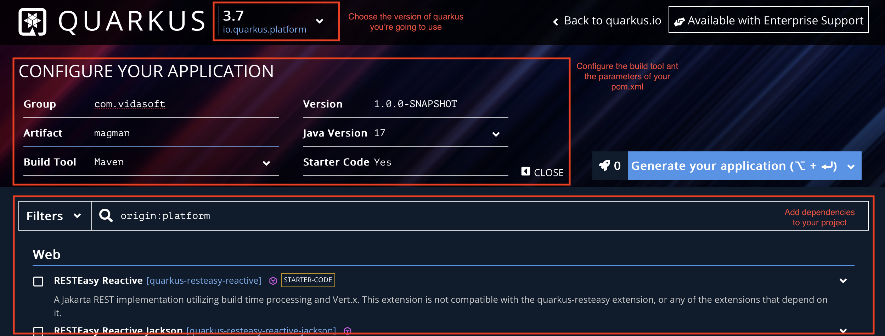

= Creating your first application with Quarkus

Now that you know what Java/Jakarta EE and Quarkus is, it is time to create our own Quarkus application.
This section will give you a quick start, showing you the ways you can create and run your a Quarkus project.
Next lessons will aim to extend that application, with intent to upgrade your knowledge and understandings.
At the end you will have a functioning example of all important Java EE specs implemented into this project.

== The https://code.quarkus.io[code.quarkus.io] approach

Starting on a new project?
It can always get a bit frustrating, having to configure your environment and deal with all the specific configurations and XMLs within your project.
Don't worry though, Quarkus has you covered.
All you need to do is go to https://code.quarkus.io.
There you will find simple and easy project generator, that will help you to set the name of the project and your package domain (group and artifact id)

The interface is quite easy to use and understand.
You can choose the version of Quarkus, the group and artifact id of your application, the version of the JDK of your application, as well as the version of your application.

Finally you are able to decide which build tool to use (either `Maven`, `Gradle` or `Gradle with Kotlin DSL`), and whether you want any "Starter code" generated or a blank project.
After that you are welcomed with a list of Quarkus Extensions you are able to choose for your generated project.
These can be extended, removed, depending on your needs.
More of that, you'll find in our next lessons.

=== Creating your first project

For the sake of ease, you can follow the configurations as shown above.
Then add the following extension to your project:

image::img/resteasy-classic-jsonb.png[align=center]

RestEasy with JSON-B are that are the first libraries that we are going to use, in order to look through our first Java EE specification - JAX-RS.

Once you have checked this extension, go and click the `Generate your application button`.
A modal window will give you the different ways you can obtain your project.

image::img/save-project.jpg[align=center]

Following the instructions, there will be three options:

. Directly download the generated project tree, zipped.
. Use the https://quarkus.io/guides/cli-tooling[Quarkus CLI]
. Use maven

If you want to go pro, you can try and create your application using the Quarkus CLI or maven.

== Creating your app with Quarkus CLI

Quarkus has provided a convenient command line interface, that allows easy interactions with your project configuration, so you can create, personalize and modify your Quarkus extensions in a jiffy.
If you feel more experienced with terminals and command lines, this would be a better approach for you to quickly generate your project.

To generate a project with Quarkus CLI, simply execute the following code:

[source,cli]
----
quarkus create app com.vidasoft:magman \
    --extension=quarkus-resteasy-jsonb
----

== Creating your app with Maven

A more verbose approach to generate your first Quarkus application would be by using Maven.
To achieve the same result, you can simply execute the following line:

[source,cli]
----
mvn io.quarkus.platform:quarkus-maven-plugin:2.12.0.Final:create \
    -DprojectGroupId=com.vidasoft \
    -DprojectArtifactId=magman \
    -Dextensions="quarkus-resteasy-jsonb"
----

TIP: To view more possibilities to generate and personalize your Quarkus project, please visit https://quarkus.io/guides/rest-json

== Let's start your project.

Now that you have the project created, let's see it running.
To run your code, simply execute `mvn quarkus:dev`.

image::img/quarkus-dev-start.jpg[align=center]

Once you see this in the command line, you can be assured your application is up and running.

Now let's test that, shall we?

Execute the following cURL:

[source,curl]
----
curl --location --request GET "localhost:8080/hello"
----

You should be greeted with the following response:

[source,text]
----
Hello RESTEasy
----

== Great! What's next?

In the next lesson, we will introduce you to Quarkus project structure, what and where everything is located, and how to modify it.