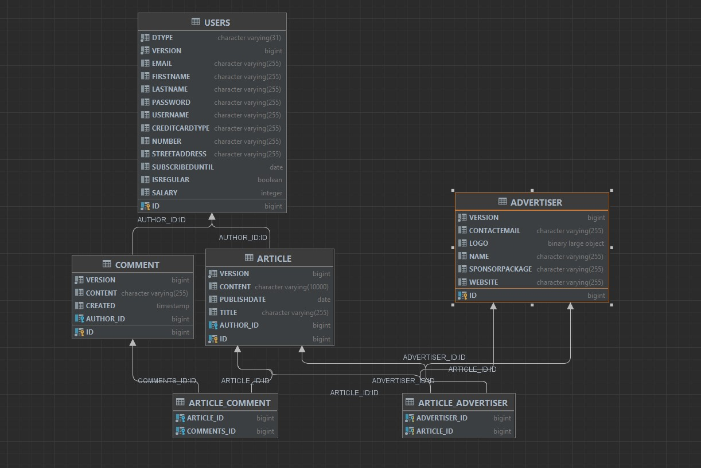

== Java Persistence API (JPA)

One of the core functions of an application server is being to work with a database.
Functions as extracting data from the database, adding or removing data on demand are crucial to all business oriented web applications.

We'll start our journey into building a magazine manager web application with setting up its data model.
The standard way to do that and to then persist the modelled data is with the Java Persistence API (JPA).

.JPA Terminology
*****************************************
*Entity* - A non-final plain old Java object (POJO) with a non-argument constructor. It represents a database table with its member variables representing the table columns.

*Persistence context*, *EntityManager* - Both terms mean one and the same thing. It is the interface that you use to load and store entities from and to the database. It acts also as a first level cache for your application.

*Persistence unit*, *EntityManagerFactory* - The factory which you use to obtain the entity manager. There you configure the way to connect to the database - a server datasource or direct JDBC properties.

*JPQL* - Object-oriented query language, based on SQL. It works on objects and their fields, rather than on tables, columns and relationships.
*****************************************

As a start we will need to add the proper configurations and extensions to make our project work with a database.

=== Adding extensions to Quarkus

Quarkus extensions are Maven dependencies which enable the framework to use annotations and functionalities, based on the application's needs.
These extensions/dependencies can be managed manually from the project's `pom.xml` or we can use the maven cli to add them with a simple one-line command.

Let's first go to our `pom.xml` and see what we have in our `<dependencies>` block.

[source,xml]
----
  <dependencies>
    <dependency>
      <groupId>io.quarkus</groupId>
      <artifactId>quarkus-resteasy-jsonb</artifactId>
    </dependency>

    <dependency>
      <groupId>io.quarkus</groupId>
      <artifactId>quarkus-arc</artifactId>
    </dependency>
    
    <dependency>
      <groupId>io.quarkus</groupId>
      <artifactId>quarkus-resteasy</artifactId>
    </dependency>
    
    <dependency>
      <groupId>io.quarkus</groupId>
      <artifactId>quarkus-junit5</artifactId>
      <scope>test</scope>
    </dependency>
    
    <dependency>
      <groupId>io.rest-assured</groupId>
      <artifactId>rest-assured</artifactId>
      <scope>test</scope>
    </dependency>
  </dependencies>
----

As you can see we have three dependencies, that are included when the application has started, and two more with `<scope>test</scope>`, which are involved only while running tests.

.Looking through our dependencies
*****************************************
*quarkus-arc* is an extension that implements the CDI 2.0 specification.
it is built and optimized according to the standards of the Quarkus application framework and server, to provide better and robust dependency injection into the project. You can find more about quarkus arc https://quarkus.io/blog/quarkus-dependency-injection/[here].

*quarkus-resteasy* is the extension, responsible for enabling the JAX-RS functionality inside quarkus.
It provides all the annotations needed to create REST endpoints for processing requests from the client and giving back responses.
More of that in a later chapter.

*quarkus-resteasy-jsonb* - this extension is used to quickly serialize/deserialize JSON objects from and to Java objects.
Most REST applications pass data through JSON, and JsonB is a library suitable to convert those to Java objects (POJOs) implicitly.

*quarkus-junit5* is an implementation of jUnit5, providing all the APIs for the jUnit testing framework.

*rest-assured* will provide APIs that allow easy testing for rest endpoints, using functional interfaces.
*****************************************

In order to work with a database, we will need to add a couple of extensions to our project:

- *quarkus-hibernate-orm-panache* - will allow to use Hibernate's JPA implementation, along with Quarkus' Panache, which is a code sugar API, adding all the needed CRUD operations to the entities.
- *quarkus-jdbc-h2* - the database driver, used to communicate with the database using Hibernate's APIs

NOTE: We'll use H2 as embedded database in this installment of our series.

To add extensions to quarkus, simply execute the following command in the terminal:

[source,shell]
----
mvn quarkus:add-extension -Dextensions="io.quarkus:quarkus-hibernate-orm-panache, io.quarkus:quarkus-jdbc-h2"
----

Now if you open `pom.xml`, you'll see that we have two new dependencies added to the list:

[source,xml]
----
    <dependency>
      <groupId>io.quarkus</groupId>
      <artifactId>quarkus-jdbc-h2</artifactId>
    </dependency>

    <dependency>
      <groupId>io.quarkus</groupId>
      <artifactId>quarkus-hibernate-orm-panache</artifactId>
    </dependency>
----

=== Adding configuration to the database

Having just the extensions added, won't help the project communicating with the database.
We also need to point it to where and what the database is.
To do so, we are going to add some properties into our `/src/main/resources/application.properties` file.

[source,properties]
----
# configure your datasource
quarkus.datasource.db-kind = h2
quarkus.datasource.username = sarah
quarkus.datasource.password = connor
quarkus.datasource.jdbc.url = jdbc:h2:file:./data/magman;DB_CLOSE_DELAY=-1

# drop and create the database at startup (use `update` to only update the schema)
quarkus.hibernate-orm.database.generation = drop-and-create
quarkus.hibernate-orm.log.sql=true
----

NOTE: Depending on the database, your configuration might vary.
In a real world scenario, you will need to configure database username and password or set a different type of generation mechanism.
You can view other examples for database configuration https://quarkus.io/guides/hibernate-orm-panache[here].

=== The database model

Now that we have our database configured, let's create our database model, following the diagram below.

First off, create a new package `magman.model` under `com.vidasoft`.
Then, let's build the core classes of the database:

[source,java]
----

public class User {
    ...
}

public class Article {
    ...
}

public class Comment {
    ...
}

public class Advertiser {
    ...
}

public class Submission {
    ...
}
----

After that's been done, let's start shaping our model classes...

=== Defining object-relational mapping with JPA 

NOTE: Depending on the version of Java you use, the following annotations could be found either in packages `javax.persistence` or `jakarta.persistence`.

Starting off with the User class, the first and most important thing we'll need to set is the annotation `@Entity`.
This is an annotation, that tells JPA, that this class is used in relation of a database table.

[source,java]
----
@Entity
@Table(name = "Users") <.>
public class User {}
----
<.> Here we are also adding an optional annotation defining the name of the table.
In most databases the word "user" is reserved to the language, as it refers to the user of the database and not some name of a table.
Therefore you should avoid using the name "user" for a table.

TIP: Sometimes you will have to model your Java objects or tables, based on an already existing database.
Usually JPA will match the name of tables and columns by their Java names, but in the case where the database already exists, names might not be exactly the same.
 +
For example you might have a table, named `CUSTOMER_USERS`, but you want to map it to a class called `User`.
To address that, you'll need to use the `@Table` annotation and set the name to the table name, related.
 +
The same thing can be done for the columns, using the `@Column` annotation.

Next important thing is to define a property for `id`, which will be our primary key to the database.

[source,java]
----
public class User {

    @Id <1>
    @GeneratedValue(strategy = GenerationType.AUTO) <2>
    public long id;
}
----
<1> `Id` annotation tells JPA that this property maps the id column of the table. 
<2> `GeneratedValue` is an annotation, that tells Hibernate how to handle id generation for new entities.
In this example `GenerationType.AUTO`, would tell Hibernate or any other ORM implementation to handle Id generation with its default setting.
The most common approach is they generate a special table, that keeps track of tha last id used and assign the next one to the entity.

One of the things we also need do decide during database modeling is how do we want the database to behave, when two or more people are trying to access the database.
Do we want the access to be one user at a time, or do we want all users to have access at any time.
This decision is usually based on how strict we should be on database integrity, and how crucial is that to the project.
The procedure we use to control that access is called locking.

.Optimistic vs pessimistic locking
*****************************************
When the access to the database is limited to one user at a time, we use the term *pessimistic locking*.
This means that when a user performs `SELECT`, `INSERT`, `UPDATE`, `DELETE` & etc. operations, other users are not allowed to access the database, and will have to wait for the operations to finish.
This type of locking guarantees that everyone is working with the most recent and up to date data and prevents conflicts, where two users might be editing the same table or column.

The other most commonly used method is called *optimistic locking*.
This type of locking relies that every table row has a specific column, that will tell which is the most recent version of the data.
That way if two users edit the same data, the first one who's going to save it, prevents the other one from overwriting it, by version comparison.
When the database has been modified, Hibernate will check the version of the persisted entity and the version of the entity wanting to be persisted and if the new entity has a version lower than the version in the database, it won't be persisted.
*****************************************

For our project we are going to use *optimistic locking*.

[source,java]
----
public class User {
    ...
    @Version <.>
    long version;
}
----
<.> With the `Version` annotation we tell our ORM that this is the field to compare when modifying data, to check whether we are working on an old invalid data or new one.

Now that we have that set, we have the bare minimum to creating object-relational mapping for our database.
We can go and add those fields to the other model classes OR there is a more neat solution to that.
If we copy-paste `id` and `version` fields to every class, we're avoiding one of the principles of using OOP language, which is abstraction.

To introduce that abstraction and allow for every entity to use the same fields, let's create the following class:

[source,java]
----
@MappedSuperclass <.>
public abstract class AbstractEntity {

    @Id
    @GeneratedValue(strategy = GenerationType.AUTO)
    public long id;

    @Version
    public long version;

}

@Entity
@Table(name = "Users")
public class User extends AbstractEntity {
    //id and version are shifted to AbstractEntity, so this class is empty now.
}
----
<.> `MappedSuperclass` is an annotation crucial to how we define abstractions in our ORM.
It tells Hibernate, that we are going to have these columns in every table.

.Abstraction in JPA
*****************************************
There are four types of entity abstraction and depending on the data model structure we have to work with, we get to choose which one is more appropriate to use:

- MappedSuperclass – the parent classes, can't have the `@Entity` annotation.
This approach will set all the columns of the superclass to the inheriting entities.
- Single Table – this method will use one table for all inheriting entities.
Querying an entity, inheriting this class, will return only the columns regarding that entity.
- Joined Table – this will create one common table for all entities, containing the common properties.
Querying an entity, inheriting such a class, will create a join query.
- Table per Class – the resulting schema is similar to the one using `@MappedSuperclass`. But Table per Class will indeed define entities for parent classes, allowing associations and polymorphic queries as a result.

You can find more about ORM abstraction https://www.baeldung.com/hibernate-inheritance[here].
*****************************************

=== Modeling the rest of the entities

Now that we have the main objects for our database model, let's add all of their columns as properties to our classes.

==== The `User` class

For our project we are going to have three types of users:

. Author - will create and comment on articles
. Subscriber - will be able to read articles, add comments and subscribe to an Advertiser package.
. Manager - will have root access to the website and be able to control the application.

Just like the `AbstractEntity`, we're again facing another abstraction dilemma.
This time, instead of using `@MappedSuperclass`, we are going to use the Single table strategy.

[source,java]
----
@Entity
@Table(name = "Users")
@Inheritance(strategy = InheritanceType.SINGLE_TABLE) <.>
public class User extends AbstractEntity {...}

@Entity
public class Author extends User {}

@Entity
public class Subscriber extends User {}

public class Manager extends User {}
----
<.> With the `Inheritance` annotation, we're telling Hibernate how to treat this abstraction.
In the case of Single table, we can omit using this annotation, as it is the default choice in JPA, when it comes to inheritance.
We are using it here, just to demonstrate how it is usually done.

With the abstractions set, now we're ready to fully define our `User` entity:

[source,java]
----
@Entity
@Table(name = "Users")
public abstract class User extends AbstractEntity {
    public String userName;
    public String password;
    public String firstName;
    public String lastName;
    public String email;
}
----

Now let's define the other three classes:

[source,java]
----
@Entity
public class Author extends User {
    public boolean isRegular;
    public int salary;
}

@Entity
public class Subscriber extends User {
    public String streetAddress;
    public LocalDate subscribedUntil;

    @Embedded <.>
    public CreditCard creditCard;
}

@Entity
public class Manager extends User {
    //This entity has no additional properties for now
}

----
<.> In the database properties from this class are stored in the same table.
Using the `Embedded` annotation helps us to achieve `has-a` relationship, without creating an additional table to the database.

TIP: If you look at our database model, you will see the column `DTYPE`.
This is a column, generated automatically by the ORM, that tells what kind of user the row is connected to. It's value can be either Author, Subscriber or Manager.

==== The `CreditCard` class

.The `@Embeddable` annotation
*****************************************
Just like abstraction, we get to choose what kind of composition we want, regarding to our ORM model.
We may have the database structured in one way, but want to use it in another way.

In our example the credit card would typically be one-to-one relationship, and we would have two ways to build this relation in our object model

- Add one-to-one relationship, using `OneToOne` annotation.
- Create an embeddable object, which is going to bind to columns of the same table, the main entity is from, separating this data.
This is used to allow a more object-oriented experience, in a scenario where the database is not modeled the same way.
*****************************************

To satisfy the `Subscriber` class, let's create the "Embeddable" `CreditCard`:

[source,java]
----
@Embeddable<.>
public class CreditCard {

    public static final CreditCard DEFAULT = new CreditCard("", CreditCardType.VISA);

    public String number;

    @Enumerated(EnumType.STRING)<.>
    public CreditCardType creditCardType;
}

public enum CreditCardType {

    VISA("Visa"), MASTER_CARD("MasterCard"), AMERICAN_EXPRESS("American Express");

    private String displayName;

    CreditCardType(String displayName) {
        this.displayName = displayName;
    }

    public String getDisplayName() {
        return displayName;
    }
}

----
<.> Annotating a class with `Embeddable` annotation, means that it cannot be an `Entity`.
Therefore no table will be created for it.
Take it as an extension to another entity.
Other than that, it behaves like any other JPA class.
On the other side, where the embeddable class is going to be embedded, we just need to add the `@Embedded` annotation (just like in `Subscriber` class).
It can contain relationships and have all types of annotations supported.
<.> The `Enumerated` annotation helps the ORM to define how this field is going to be shaped into a column.
There're two strategies:
 +
- `EnumType.STRING` (Recommended) - will persist the enum as varchar string. (e.g. `CreditCardType.VISA` would be persisted as `"VISA"`)
- `EnumType.ORDINAL` - will persist the enum as an integer, depending on the position of the enumerated value.

CAUTION: Using `EnumType.ORDINAL` is prone to bugs.
This is due to the nature those ordinals are assigned. If for example we have `VISA, MASTERCARD`, their ordinals would be `0, 1`, but if somebody swaps those, the order of the ordinals will remain the same.
This means that it is very easy to change the Credit card type by a mistake and the ORM will not be able to recognize that.
To avoid it, it is better to use `EnumType.STRING`.
 + 
When it comes to changing the name of the enum, it is better to get a runtime error, when casting that name to enum, than getting seemingly unrelated errors, due to switched enum order. 

==== The `Article` class

We are going to define the `Article` class as follows:

[source,java]
----
@Entity
public class Article extends AbstractEntity {
    public String title;
    public String content;
    public LocalDate publishDate;

    @ManyToOne <.>
    public Author author;

    @OneToMany <.>
    public List<Comment> comments = new ArrayList<>();
}
----
<.> Defines that one author has many articles
<.> Defines that one article has many comments

.The proper way to define relationships in ORM
*****************************************
The common way of mapping one-to-many or many-to-one relationships would be to have reference in both entities, meaning that `Article` should have many-to-one relationship with the `Author`, and the author should have one-to-many relationship with the `Article`.
This would mean that we would also need to add `List<Article> articles` to the `Author` entity, just like we're doing with the comments.

> But wait! That's not all!

We actually don't want to do that. 

And why?

Imagine the following scenario...

You want to get a list of all authors.
But along with that, you might also be getting the list of all of their articles.
This would add a lot of load to the database.
You want to get articles only when you need them, as much as you need of them.
With the one-to-many approach you are able to get all or none.
Imagine if the amount of articles is 1000 or more...

But why did we leave the one-to-many relationship for the comments?

Consider this relationship as one-to-*few*.
In our scenario when we ask for an Article, we would also be wanting all of its comments.

But there's more.
Loading child data, by default, is lazy, meaning that it will be queried only if it's needed. More of that, later in this chapter.

TIP: To learn more about why many-to-one is the better way to approach large 1:n relationships, you can also https://vladmihalcea.com/the-best-way-to-map-a-onetomany-association-with-jpa-and-hibernate/[read this article here].

*****************************************

==== The `Comment` class

We're almost at the end of our data modeling.
Here is how our `Comment` class should look like:

[source,java]
----
@Entity
public class Comment extends AbstractEntity {

    private String content;

    @ManyToOne
    private User author;

    private LocalDateTime created;

}
----

Nothing particular to add here, let's move on.

==== The `Advertiser` class

This class will introduce advertisers or sponsors to our magazine.

[source,java]
----
@Entity
public class Advertiser extends AbstractEntity {

    public String name;

    public String website;

    public String contactEmail;

    @Lob <.>
    public byte[] logo;

    @Enumerated(EnumType.STRING)
    public SponsorPackage sponsorPackage;

}

public enum SponsorPackage {

    GOLD(1000), SILVER(500), BRONZE(100);

    private int price;

    SponsorPackage(int price) {
        this.price = price;
    }

    public int getPrice() {
        return price;
    }
}
----
<.> `Lob` is an annotation pointing that the data passed to the database will be of a binary type.
It is recommended to use primitive arrays here, because in memory they will keep all values in one array and will be faster to access.
Using wrapped object array, such as `Byte`, will add performance delay, as the references to the values will be scattered throughout the system's memory.