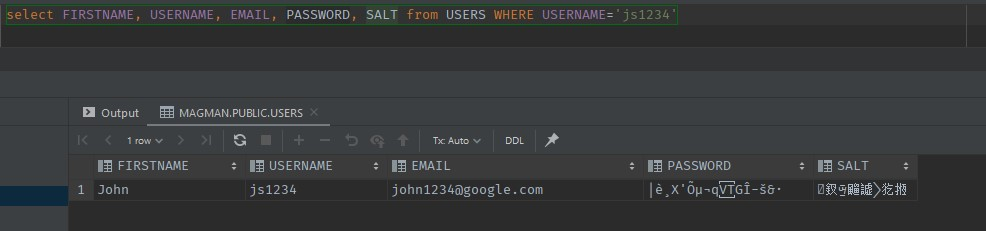

== Dependency injection with Quarkus and Jakarta EE

One of the most relevant and long-lasting concepts in object-oriented programming, embedded into the foundation of all web server frameworks is the Dependency injection.
These techniques also allow to achieve the so called "inversion of control" (IoC for short), where the chain of classes, depending on one another is reversed and decoupled.
This allows the developer to change the implementation of one module with another, without having to retouch the whole chain of dependencies, but it also helps instantiating dependencies, without concerning about the initialization, such as constructors, variables and other related dependencies.
A way to achieve the inversion of control is having an IoC container.
The IoC container represents an API that stores, manages and controls instantiations of dependencies.
One such container is the Jakarta EE CDI.

TIP: There is a very good example on what dependency injection is, much easier to understand.
Imagine your class is a small child, who wants to take something out from the upper shelf of a fridge.
They can either do it themselves and risk making a mess, like dropping and breaking stuff, or they can ask its parent (IoC container), to give it to them.
The parent has the knowledge, height and strength to be capable to know what is good for the child, whether they should have that item, or a substitute and pass the item to the child safely.

=== What is CDI

As mentioned above CDI (Context and Dependency Injection) is one of the specifications of Jakarta EE, that is capable of managing dependencies within your application using scopes (we'll talk about them in a bit).
Instead of using constructors to create instances and connections between the modules of your application, you can rely on the CDI, to provide your classes with the instance they need.

During any application development one huge role, that plays into good practices is the separation of concerns.
This means that a class or a method should do exactly the thing they are supposed to do, without any additional jobs, which we call side effects.
So for example a Resource class is supposed to accept requests, validate queries and return responses, but not look into connecting with the database, building a query or executing complex operations directly on the database, such as performing multiple queries at once.
This is business logic, that is suitable to live on a separate layer in our server.
This layer is usually called a service.
The service class will do all the hard job regarding all additional operations out request has to perform, keeping our resource method clean from any additional distractions.

[TIP]
====
Layering within your application is subjective.
You are able to do whatever you like with your code, with one rule on the thumb - keep it clear and consistent.
So depending on the framework you are using, you have to figure out how to better structure your project to make it easy to understand and maintain. 

If your business logic is doing more than just getting some data as is, than maybe this is suitable for a service.
Depending on the framework you are using, you might need to also have a Data Access Object layer (DAO) or Repository layer where you keep all your queries to the database.
With Quarkus and Panache those types of layers are not needed, as the Panache Active Record pattern already serves as such a layer.
====

In Quarkus, the CDI implementation is provided by https://quarkus.io/blog/quarkus-dependency-injection/[Quarkus ArC].
Let's see how we can apply CDI in action for our project and explain how everything works.

=== The Application and Request scopes

To begin, we are going to create the `UserResource` class, which is going to contain two methods:

- `registerUser`
- `loginUser`

[source,java]
----
@Path("user")
public class UserResource {

    @POST
    @Consumes(MediaType.APPLICATION_JSON)
    public Response registerUser(NewUserDTO newUserDTO) {

    }

    @POST
    @Path("login")
    @Consumes(MediaType.APPLICATION_JSON)
    public Response loginUser(LoginDTO login) {

    }

}

public class NewUserDTO extends UserDTO {

    private String password;
    private UserType userType;

    public String getPassword() {
        return password;
    }

    public void setPassword(String password) {
        this.password = password;
    }

    public UserType getUserType() {
        return userType;
    }

    public void setUserType(UserType userType) {
        this.userType = userType;
    }
}

public class LoginDTO {

    private String userName;
    private String password;

    public String getUserName() {
        return userName;
    }

    public void setUserName(String username) {
        this.userName = username;
    }

    public String getPassword() {
        return password;
    }

    public void setPassword(String password) {
        this.password = password;
    }
}

public enum UserType {

    AUTHOR, SUBSCRIBER, MANAGER;

}

----

As you may notice `NewUserDTO` extends `UserDTO`, which used to contain the password property.
This property was previously being used by the `AuthorDTO`, which also extends the `UserDTO`, in order to create the author.
But now as we have the `NewUserDTO`, we need to move that field there.
 +
We also don't need the `AuthorResource.createAuthor` method, as all user creations will be managed from `UserResource` from now on.

With the current knowledge we have, our implementation would look something like this:

[source,java]
----
@Path("user")
public class UserResource {

    @POST
    @Transactional
    @Consumes(MediaType.APPLICATION_JSON)
    public Response registerUser(NewUserDTO newUserDTO) {
        if (checkIfNull(newUserDTO.getUserName(), newUserDTO.getPassword(),
                newUserDTO.getFirstName(), newUserDTO.getLastName(), newUserDTO.getUserType(), newUserDTO.getEmail())) {
            return Response.status(Response.Status.BAD_REQUEST).build();
        }

        Optional<User> existingUser = User.find("userName = ?1 or email = ?2", newUserDTO.getUserName(),
                newUserDTO.getEmail()).firstResultOptional();
        if (existingUser.isPresent()) {
            return Response.status(Response.Status.CONFLICT).build();
        }

        User createdUser = null;
        switch (newUserDTO.getUserType()) {
            case AUTHOR:
                createdUser = new Author(newUserDTO.getUserName(), newUserDTO.getPassword(), newUserDTO.getFirstName(),
                        newUserDTO.getLastName(), newUserDTO.getEmail(), true, 0);
                break;
            case MANAGER:
                createdUser = new Manager(newUserDTO.getUserName(), newUserDTO.getPassword(), newUserDTO.getFirstName(),
                        newUserDTO.getLastName(), newUserDTO.getEmail());
                break;
            case SUBSCRIBER:
                createdUser = new Subscriber(newUserDTO.getUserName(), newUserDTO.getPassword(), newUserDTO.getFirstName(),
                        newUserDTO.getLastName(), newUserDTO.getEmail(), null, LocalDate.now().plusYears(1),
                        null);
                break;
        }

        createdUser.persist();
        return Response.status(Response.Status.CREATED).build();
    }

    @POST
    @Path("login")
    @Consumes(MediaType.APPLICATION_JSON)
    public Response loginUser(LoginDTO login) {
        if (checkIfNull(login.getUsername(), login.getPassword())) {
            return Response.status(Response.Status.BAD_REQUEST).build();
        } else {
            User loggedUser = User.find("userName = ?1 and password = ?2", login.getUsername(), login.getPassword())
                    .firstResult();
            if (loggedUser == null) {
                return Response.status(Response.Status.UNAUTHORIZED).build();
            } else {
                return Response.ok(new UserDTO(loggedUser)).build();
            }
        }
    }

    private boolean checkIfNull(Object... fields) {
        for (var field : fields) {
            if (field == null) {
                return true;
            }
        }

        return false;
    }

}
----

But from what you can see here, there is too much stuff in one place.
We're doing data validations, database lookups, conditional user creations... 
Oh! And did you notice?
We're storing the user's password IN PLAIN TEXT!

As mentioned earlier a resource class should do simple things.
It should take data and return data.
Any additional operations, are better to happen upon a separate layer.
So let's create that layer, shall we?

Create a class in `user` package, called `UserService`.
This class will contain all of our additional operations, regarding user registration and login.
 +
Then move some of the code of `UserResource` to the user service.

[source,java]
----
public class UserService {

    public User registerUser(String firstName, String lastName, String email, String username, String password, UserType userType) {
        User createdUser = null;
        switch (userType) {
            case AUTHOR:
                createdUser = new Author(username, password, firstName, lastName, email, true, 0);
                break;
            case MANAGER:
                createdUser = new Manager(username, password, firstName, lastName, email);
                break;
            case SUBSCRIBER:
                createdUser = new Subscriber(username, password, firstName, lastName, email, null, LocalDate.now().plusYears(1), null);
                break;
        }

        createdUser.persist();
        return createdUser;
    }

    public Optional<User> loginUser(String username, String password) {
        return User.find("userName = ?1 and password = ?2", username, password).firstResultOptional();
    }

}
----

And now let's see how we can call this class from `UserResource`.
Truth is, it's fairly simple.

. Add `@ApplicationScoped` annotation on `UserService` class
+
[source,java]
----
@ApplicationScoped
public class UserService {...}
----

. In `UserResource`, define `UserService` as a global property and add `@Inject` on that property.
+
[source,java]
----
@Path("user")
public class UserResource {

    @Inject
    UserService userService;

    @POST
    @Transactional
    @Consumes(MediaType.APPLICATION_JSON)
    public Response registerUser(NewUserDTO newUserDTO) { ... }

    @POST
    @Path("login")
    @Consumes(MediaType.APPLICATION_JSON)
    public Response loginUser(LoginDTO login) { ... }
}
----

. Now let's start using `userService` inside our code.
+
[source,java]
----
    @POST
    @Transactional
    @Consumes(MediaType.APPLICATION_JSON)
    public Response registerUser(NewUserDTO newUserDTO) {
        if (checkIfNull(newUserDTO.getUserName(), newUserDTO.getPassword(),
                newUserDTO.getFirstName(), newUserDTO.getLastName(), newUserDTO.getUserType(), newUserDTO.getEmail())) {
            return Response.status(Response.Status.BAD_REQUEST).build();
        }

        Optional<User> existingUser = User.find("userName = ?1 or email = ?2", newUserDTO.getUserName(),
                newUserDTO.getEmail()).firstResultOptional(); <1>
        if (existingUser.isPresent()) {
            return Response.status(Response.Status.CONFLICT).build();
        }

        userService.registerUser(newUserDTO.getFirstName(), newUserDTO.getLastName(), newUserDTO.getEmail(),
                newUserDTO.getUserName(), newUserDTO.getPassword(), newUserDTO.getUserType()); <.>
        return Response.status(Response.Status.CREATED).build();
    }

    @POST
    @Path("login")
    @Consumes(MediaType.APPLICATION_JSON)
    public Response loginUser(LoginDTO login) {
        if (checkIfNull(login.getUsername(), login.getPassword())) {
            return Response.status(Response.Status.BAD_REQUEST).build();
        } else {
            Optional<User> loggedUser = userService.loginUser(login.getUsername(), login.getPassword()); <1>
            return loggedUser
                    .map(u -> Response.ok(new UserDTO(u)).build())
                    .orElseGet(() -> Response.status(Response.Status.UNAUTHORIZED).build());
        }
    }
----
<1> As you can see, we can refer to `UserService` like we would with any other instance of a class.

.Scopes in CDI
*****************************************
In CDI every dependency, also called bean, has its own rate of instantiation and lifespan.
This is called "scope".
In vanilla CDI, the CDI, defined by Jakarta/Java EE, there are five scopes:

- `@RequestScoped` - upon every new request to the server a new instance of that class is created.
When the response has been returned, the instance is destroyed.
This allows multiple clients to request the same endpoint, with their own data and parameters, without interfering with each-other.
Upon creations of these requests, the CDI implementation will decide how to manage the load and might create separate threads to run multiple requests simultaneously.

- `@ApplicationScoped` - one instance of the class is created for the whole lifespan of the server's runtime.
Once an ApplicationScoped dependency has been injected into a class, it will create a single instance (singleton), which will be passed serverwide every time it's been injected, regardless of the scope of the depending class.
 +
For example, if the class is RequestScoped, each instance of that class will get the same instance of ApplicationScoped class.
This means that the ApplicationScoped annotation is suitable for stateless classes, which are not subject to changes.
It is not recommended to define stateful properties into an ApplicationScoped class, such as user data.
 +
Service classes are good example suitable for the `@ApplicationScoped` annotation.
They mostly contain methods, which do the same job every time and we do not need more than one instance of such a class.

- `@SessionScoped` - those type of dependencies have active instance during the lifetime of a user session.
When an user opens the page of a website for the first time, they will get a session cookie with item, called `JSESSIONID`.
The `JSESSIONID` is an identifier which the client then passes to the server upon each request.
With it CDI is capable of recognizing the user and binding their data with the `@SessionScoped` class instance.
`@SessionScoped` will create as many instances, as active clients are on the server.
It is suitable for storing user data, such as their email, permissions, preferences and so on.

- `@ConversationScoped` - this scope allows for the developer do control the creation and destruction of the instance.
Followed with injection of `jakarta.enterprise.context.Conversation` and methods `conversation.begin()` and `conversation.end()`, the developer is able to decide when the instantiation should start and where it should end.
+
NOTE: Both `@SessionScoped` and `@ConversationScoped` classes need to implement the `Serializable` interface, due to their long-lasting as those instances are stored int the user's HTTP session, which is sometimes saved as a file on the disk.

- `@Dependant` - this scope inherits the scope of the depending class.
If you inject a Dependant class into `@RequestScoped` bean, CDI will create a new instance with Request scope, if you do it in `@ApplicationScoped` bean, it will do it with a single instance, same as the depending class.

The instances passed to each class, injecting those dependencies are proxies.
In order to guarantee safety, you can never access and modify the real instance through reflection.
This is important for a service that is meant to be active 24/7 and be robust.

CAUTION: Due to the way proxies are implemented, mixing scopes in some CDI implementations may, or may not work.
For example injecting a `@RequestScoped` dependency into `@ApplicationScoped` bean on some servers may result in that instance being injected once for the whole lifespan of the `@ApplicationScoped` bean.
This may cause issues, such as getting the same data on each new request, instead of getting newer data for that request.

In Quarkus ArC there are 3 scopes implemented - Request, Application and Dependant scopes.
This is due to the fact, that Quarkus servers are meant to be stateless.
All the user data and configurations should come from outside in the form of a token (JWT for example).

NOTE: Usually Resource endpoints should be annotated with some kind of scope, most commonly `@RequestScoped` in order to work, but Quarkus ArC recognizes those endpoints and gives them that scope implicitly.
This works only for endpoints, so if you want to inject any other dependency it must have at least `@Dependant` scope. 

*****************************************

Going back to our project, we mentioned that we are saving the user with plain text password.
As you may suggest this is very bad idea, so let's do something about it.

First add a new field to the user entity, called `salt`.
Now let's create a new class and package `security.PasswordService`.
You should be guessing what comes next...

[source,java]
----
@ApplicationScoped
public class PasswordService {

    public String encryptPassword(String password, String salt) {

    }
    
    public String generateSalt() {
        
    }

}
----

Just encrypting the password will not be enough to have a fully protected password.
It will still be susceptible to https://www.beyondidentity.com/glossary/rainbow-table-attack["Rainbow attacks"], which are a way to reverse engineer the password.
Adding salt to the password, which is a random string of characters, then using encryption algorithm before saving the password to the database will make the password unbreakable.
Even if somebody got the user's hashed password and the salt, they will have a hard time to figure out the password, as due to encryption, which produces a way different hash, than what encrypting a single password would do.

Having said that, the implementation of our password service, would look like this:

[source,java]
----
@ApplicationScoped
public class PasswordService {

    private static final String ENCRYPTION_KEY = "$oME$anD0mKey!@#";
    private static final int SALT_LENGTH = 8;

    public String encryptPassword(String password, String salt) {
        var saltedPassword = password + salt;

        Key aesKey = new SecretKeySpec(ENCRYPTION_KEY.getBytes(), "AES");
        try {
            Cipher cipher = Cipher.getInstance("AES");
            cipher.init(Cipher.ENCRYPT_MODE, aesKey);
            byte[] encrypted = cipher.doFinal(saltedPassword.getBytes());
            return new String(encrypted);
        } catch (Exception e) {
            return password;
        }
    }

    public String generateSalt() {
        StringBuilder sb = new StringBuilder();
        Random random = new Random();
        for (int i = 0; i < SALT_LENGTH; i++) {
            sb.append((char) random.nextInt());
        }

        return sb.toString();
    }

}
----

Now it's time to add that to our `UserService`.

[source,java]
----
@ApplicationScoped
public class UserService {

    @Inject
    PasswordService passwordService; <.>

    public User registerUser(String firstName, String lastName, String email, String username, String password, UserType userType) {
        User createdUser = null;
        switch (userType) {
            case AUTHOR:
                createdUser = new Author(username, password, firstName, lastName, email, true, 0);
                break;
            case MANAGER:
                createdUser = new Manager(username, password, firstName, lastName, email);
                break;
            case SUBSCRIBER:
                createdUser = new Subscriber(username, password, firstName, lastName, email,
                        null, LocalDate.now().plusYears(1), null);
                break;
        }

        var salt = passwordService.generateSalt(); <.>
        createdUser.salt = salt;
        createdUser.password = passwordService.encryptPassword(password, salt);

        createdUser.persist();
        return createdUser;
    }

    public Optional<User> loginUser(String username, String password) {
        User user = User.find("userName", username).firstResult(); <.>
        if (user != null) {
            var hashedPassword = passwordService.encryptPassword(password, user.salt);
            if (hashedPassword.equals(user.password)) {
                return Optional.of(user);
            }
        }

        return Optional.empty();
    }

}
----
<.> Just like injecting `UserService` into `UserResource`, here we are injecting the `PasswordService`.
When the `PasswordService` proxy is called for the first time, CDI will instantly create a singleton instance, which will remain active through the whole runtime of the server.

<.> Here, before we persist the newly created user, we first need to encrypt their password.
First we need to generate the salt and set it to the user, then we need to call the `encryptPassword()` method and set the password to the new user.
Finally we are able to persist, the user.

<.> Now that we store the encrypted password, we cannot directly compare the plain text password with the one stored into the database.
To be able to validate the user's password, we first need to encrypt it, and to do so, we need the same salt we used during the encryption in the first place, so this requires to pull out the user from the database to get their salt.
If both the encrypted passwords match, then we can return that user to the resource.

Now if we try to create a new user and try to query the database, to see how they were created, we'll stumble upon the following result:

=== Injecting `EntityManager` with CDI

Remember when we instantiated the `EntityManager` from the constructor of a resource?
The reason why this worked, is because in Quarkus, CDI works even on constructor level.
And having said that JTA-managed `EntityManager` is controlled by the CDI container as well.

Let's go back to our `CommentResource` and see how we can optimize our class.
Knowing that we can separate more complex operations into a different layer of our package (called service 😉), let's move some stuff to the `CommentService`...

[source,java]
----
@ApplicationScoped
public class CommentService {

    @Inject
    EntityManager entityManager; <.>

    public Comment createComment(String content, User author, Article article) {
        Comment comment = new Comment(content, author, LocalDateTime.now());
        comment.article = article;
        comment.persist();
        return comment;
    }

    public Optional<CommentDTO> getCommentById(long commentId) {
        return entityManager.createNamedQuery(Comment.GET_COMMENT_BY_ID, CommentDTO.class)
                .setParameter("commentId", commentId)
                .getResultStream()
                .findFirst();
    }

}
----
<.> As you can see `EntityManager` could be injected using the same techniques as the one used for other dependencies.
It's worth mentioning that the instance of JTA managed `EntityManager` is RequestScoped.

As for the `CommentResource` class, it will end up looking like this:

[source,java]
----
@Path("/article/{id}/comment")
public class CommentResource {

    @Inject
    CommentService commentService;

    @POST
    @Transactional
    @Consumes(MediaType.APPLICATION_JSON)
    public Response createComment(@PathParam("id") Long articleId, CommentDTO commentDTO) {
        if (articleId == null || articleId < 1 || commentDTO.getAuthorId() == null || commentDTO.getAuthorId() < 1) {
            return Response.status(Response.Status.BAD_REQUEST).build();
        }

        User author = User.findById(commentDTO.getAuthorId());
        if (author == null) {
            return Response.status(Response.Status.BAD_REQUEST).build();
        }

        Article article = Article.findById(articleId);
        if (article == null) {
            return Response.status(Response.Status.NOT_FOUND).build();
        }

        Comment comment = commentService.createComment(commentDTO.getContent(), author, article);

        return Response.created(URI.create(String.format("/article/%d/comment/%d", articleId, comment.id))).build();
    }

    @GET
    @Path("/{commentId}")
    @Produces(MediaType.APPLICATION_JSON)
    public Response getCommentById(@PathParam("commentId") Long commentId) {
        if (commentId == null || commentId < 1) {
            return Response.status(Response.Status.BAD_REQUEST).build();
        } else {
            return commentService.getCommentById(commentId)
                    .map(c -> Response.ok(c).build())
                    .orElseGet(() -> Response.status(Response.Status.NOT_FOUND).build());
        }
    }
}
----

=== `@PostConstruct` and `@PreDestroy`

In a typical class, the way you initialize an instance and its properties is by using the constructor.
But in CDI managed class there is more safe and convenient way to do so.
By creating a method and annotating it with `@PostConstruct`, CDI will invoke that method, the moment, the class is ready to use all of it's dependencies.

For example, let's say we want to log every attempt to access the `UserResource` endpoints.

[source,java]
----
@Path("user")
public class UserResource {

    Logger logger = Logger.getLogger(this.getClass().getName());

    @Inject
    UserService userService;

    @Inject
    HttpServerRequest request;

    @PostConstruct
    void init() {
        String requestPath = request.uri();
        var originIp = request.remoteAddress().toString();
        logger.log(Level.INFO, "URL call attempt {0} from {1}", new String[] {requestPath, originIp});
    }

    //Endpoints
}
----

As you can see, we're taking the request data from the class `io.vertx.core.http.HttpServerRequest`, which is injected by CDI.
If we did that in the constructor of the class, we wouldn't have been able to use that class.
This comes to our conclusion, that the execution of `@PostConstruct` happens after all of our dependencies are injected.

`@PreDestroy` works in the same manner, but to see it in work, you'll need to annotate your resource with `@RequestScoped`, as the scope of resource without a scope annotation is not RequestScoped by default.
Then we can create a method like this:

[source,java]
----
@RequestScoped
@Path("user")
public class UserResource {

    Logger logger = Logger.getLogger(this.getClass().getName());

    @Inject
    UserService userService;

    @Inject
    HttpServerRequest request;

    @PostConstruct
    void init() {...}

    @PreDestroy
    void destroy() {
        String requestPath = request.uri();
        var originIp = request.remoteAddress().toString();
        logger.log(Level.INFO, "Scope completed for {0} from {1}", new String[] {requestPath, originIp});
    }

    //Endpoints
}
----

Once the response of the endpoint has been returned, the `destroy()` method will be called, and execute all the code inside.
You can use this to close certain kind of connections or execute some kind of a task.
Or like in our case, just log something.

=== Interceptors and decorators

One other useful tool CDI provides is the ability to intercept or decorate the executions of a CDI-managed method.
Basically both do the same thing, but serve a different purpose.

An example of where an interceptor or decorator could be used, would be in the cases where something's meant to happen, but it is neither a concern for the resource, nor for the service class.
In our project when we create an article or a comment, we use to set the publish date inside the constructor of the Article/Comment.
There's nothing wrong with that, but in theory it's an action that is not a concern for either of the service classes, making the article.
It is also repetitive.
Actions or operations which do not belong to the purpose of the single responsibility of a method are called *cross-cutting concerns*.
So what can we do about it?

==== Interceptors

First, since both articles and comments have the same property called `publishDate` (or `created`), we can unify those in an abstract class, to inherit them on both classes.

[source,java]
----
@MappedSuperclass
public class PublishedContent extends AbstractEntity {

    public LocalDateTime publishDate;
    public LocalDateTime lastModified;

}

//And then extend our entities, and remove their date property

public class Article extends PublishedContent {...}

public class Comment extends PublishedContent {...}

----

Now in order to attach the appropriate dates to our content, we need to create some annotations.
To make things cleaner, let's add a new package, called `interceptors`, and add two new annotations:

- `@CreatesContent`
- `@ModifiesContent`

[source,java]
----
import javax.interceptor.InterceptorBinding;
import java.lang.annotation.Inherited;
import java.lang.annotation.Retention;
import java.lang.annotation.Target;

import static java.lang.annotation.ElementType.METHOD;
import static java.lang.annotation.ElementType.TYPE;
import static java.lang.annotation.RetentionPolicy.RUNTIME;

@Inherited
@InterceptorBinding
@Target({TYPE, METHOD})
@Retention(RUNTIME)
public @interface CreatesContent {
}

@Inherited
@InterceptorBinding
@Target({TYPE, METHOD})
@Retention(RUNTIME)
public @interface ModifiesContent {
}
----

Then we need to place these annotations on the service methods we are going to intercept.

[source,java]
----
@ApplicationScoped
public class ArticleService {

    @CreatesContent
    public Article createArticle(String title, String content, Author author) {
        Article article = new Article(title, content, author);
        article.persist();
        return article;
    }

    @ModifiesContent
    public void editArticle(Article article, String title, String content) {
        article.title = title;
        article.content = content;
    }

}
----

You can do the same with the comment.

But we're not finished.
Although we have the annotations we are still not intercepting anything, as we have not implemented any logic for that. Let's do it.

Inside the `interceptors` package, let's create two new classes - `CreatesContentInterceptor` and `ModifiesContentInterceptor`.

[source,java]
----

@Interceptor <1>
@CreatesContent <2>
@Priority(Interceptor.Priority.APPLICATION) <3>
public class CreatesContentInterceptor {

    @AroundInvoke
    public Object contentCreated(InvocationContext invocationContext) throws Exception {
        Object returnedObject = invocationContext.proceed(); <4>
        if (returnedObject instanceof PublishedContent) {
            var content = (PublishedContent) returnedObject;
            content.publishDate = LocalDateTime.now();
            content.lastModified = LocalDateTime.now();
        }

        return returnedObject;
    }

}

@Interceptor <1>
@ModifiesContent <2>
@Priority(Interceptor.Priority.APPLICATION) <3>
public class ModifiesContentInterceptor {

    @AroundInvoke
    public Object contentModified(InvocationContext invocationContext) throws Exception {
        Object[] arguments = invocationContext.getParameters(); <5>
        for (var argument : arguments) {
            if (argument instanceof PublishedContent) {
                var content = (PublishedContent) argument;
                content.lastModified = LocalDateTime.now();
            }
        }

        return invocationContext.proceed(); <6>
    }
}

----
<1>  With the `@Interceptor` annotation, we tell our application server that this class serves as an interceptor.

<2> The annotation we created will tell CDI to which classes it should listen to invoke them.

<3> The `@Priority` annotation defines the order of invocation of annotations.
Its value is of type integer.
The higher the priority the least the chance of this annotation being called first.
This is helpful for example when one method has two interceptors.
With the `@Priority` annotation you can define which interceptor gets called first.
`Interceptor.Priority.APPLICATION` equals 0, meaning that this interceptor it will be called with highest priority.

<4> `invocationContext.proceed()` means to execute the intercepted method.
You can run your method during interception.
Here this is done, so we can get the return value of that method, which we are interested in.
Then we are checking if the returned type is the type we need and set the date of the content.

<5> In this case we are interested of the passed entity, which is going to be updated.
We are considering that all of our update methods will contain the entity which is going to be updated.
If that's not the case, this interceptor won't do anything.

<6> Here we are not interested of the interceptor's result, so we are directly returning whatever needs to be returned. (In object oriented programming `void` is also a return type)

NOTE: Keep in mind that in our examples the `@Transactional` scope is running during this operations, as it is annotated on the resource level.
So any changes created to the entities in the scope of the interceptor are going to reflect on the entity.
If your implementation is different, you'll need to adjust it to ensure transactions are occurring and entities are attached.

Knowing all that, we can understand how the `@Transactional` annotation is working.
It is an interceptor responsible for managing the transactions during the execution of a method.

==== Decorators

Unlike interceptors, which are meant to be used mostly to modify unrelated to the resource or service data, decorators have a bit more different purpose.
The use of decorators, as the name suggests, is meant do _decorate_ the data.
A scenario where a decorator would be useful is if you make some kind of request, but the response contains stuff that no service or resource is responsible to provide.

Let's develop our `Advertiser` entity to see how it can come in handy, when using decorators.

- Create `AdvertiserResource` that supports some type of CRUD operations
- Create `AdvertiserService` if needed
- Create some `Advertiser` entities

In most blogs or magazines you'll see sponsored messages or a list of sponsors.
In our Magazine Manager, the advertiser is a sponsor who has donated to support an article.
We want to list those advertiser names into the content of an article.
This creates a challenge as we neither want to edit the content of the article, nor do we want to introduce a logic to the `ArticleService` that is not a concern for it.
So what do we do?
We create a decorator.

First, let's move the `getArticle()` method into `ArticleService`.
To simplify stuff, we're going to ditch the `withComments` part.
It was used only to demonstrate how `NamedQueries` work, but in real practice you wouldn't do it like that for something as simple.

This would make our `ArticleResource` and `ArticleService` look like this:

[source,java]
----
@RequestScoped
@Path("/article")
public class ArticleResource {

    @Inject
    ArticleService articleService;

    //endpoints
    
    @GET
    @Path("/{id}")
    @Produces(MediaType.APPLICATION_JSON)
    public Response getArticle(@PathParam("id") Long articleId) {
        if (articleId == null) {
            return Response.status(Response.Status.BAD_REQUEST).build();
        }

        return articleService.getArticle(articleId)
                .map(article -> Response.ok(new ArticleDTO(article)).build())
                .orElseGet(() -> Response.status(Response.Status.NOT_FOUND).build());
    }

    //endpoints
}

@ApplicationScoped
public class ArticleService {

    public Optional<Article> getArticle(long articleId) {
        return Article.findByIdOptional(articleId);
    }

    @CreatesContent
    public Article createArticle(String title, String content, Author author) {
        Article article = new Article(title, content, author);
        article.persist();
        return article;
    }

    @ModifiesContent
    public void editArticle(Article article, String title, String content) {
        article.title = title;
        article.content = content;
    }
}
----

Then we recommend to rename the `ArticleService` into `ArticleServiceImpl`, so you can turn the `ArticleService` class into interface.
Add all the methods of `ArticleServiceImpl` into that interface.

[source,java]
----    
public interface ArticleService {

    Optional<Article> getArticle(long articleId);

    Article createArticle(String title, String content, Author author);

    void editArticle(Article article, String title, String content);

}

@ApplicationScoped
public class ArticleServiceImpl implements ArticleService {

    public Optional<Article> getArticle(long articleId) {...}

    @CreatesContent
    public Article createArticle(String title, String content, Author author) {...}

    @ModifiesContent
    public void editArticle(Article article, String title, String content) {...}

}
----

Then it's time to build our decorator class.

[source,java]
----
@Decorator <.>
public abstract class ArticleDecorator implements ArticleService { <.>

    @Inject
    @Delegate <.>
    ArticleService articleService;

    @Override
    public Optional<Article> getArticle(long articleId) {
        return articleService.getArticle(articleId)
                .map(this::decorateArticle);
    }

    private Article decorateArticle(Article article) {
        var advertisers = article.advertisers;
        var message = String.format("\nThis article has been sponsored by: %s",
                advertisers.stream().map(a -> a.name).collect(Collectors.joining(", ")));
        var decoratedArticle = new Article(article.title, article.content + message, article.author); <.>
        decoratedArticle.id = article.id;
        return decoratedArticle;
    }
}
----
<.> We use the `@Decorator` annotation to notify CDI that this class will be called to wrap the real instance of `ArticleServiceImpl`.

<.> The decorator should be abstract and implement `ArticleService` as well.
Making it abstract let us control on which methods should we implement decorators.

<.> The `@Delegate` annotation is mandatory for CDI to inject the appropriate implementation for `ArticleService`.
+
NOTE: Usually when you pass Inject on an interface, CDI will try and look for implementations with CDI context.
We'll talk more about that in our "_Producers and Alternatives_" section.

<.> At the ned we create a new instance of `Article` in order to detach it from the database, so we don't cause any changes on the attached entity we might be working with.
As you can see by the parameters, we can't be sure when is this method called.
It might be called in `@Transactional` scope, so we have to make sure that we are not working directly with the entity.

Now add some advertisers to some articles, so you can experience the decoration magic.

[source,java]
----
@RequestScoped
@Path("/article")
public class ArticleResource {

    //Other endpoints

    @PATCH
    @Transactional
    @Path("{id}/advertiser/{advertiserId}")
    public Response addAdvertiserToArticle(@PathParam("id") Long id, @PathParam("advertiserId") Long advertiserId) {
        if (id == null || advertiserId == null) {
            return Response.status(Response.Status.BAD_REQUEST).build();
        }

        Article article = Article.findById(id);
        Advertiser advertiser = Advertiser.findById(advertiserId);

        if (article == null || advertiser == null) {
            return Response.status(Response.Status.NOT_FOUND).build();
        }

        article.advertisers.add(advertiser);
        return Response.status(Response.Status.NO_CONTENT).build();
    }
}
----

Now when you make a call for getting an article by id, you should get a response similar to this:

[source,json]
----
{
    "authorId": 1,
    "content": "The quick brown fox runs over the lazy dog.\nThis article has been sponsored by: Google",
    "id": 3,
    "title": "Article for the soul."
}
----

[TIP]
====
Want to do some more decorators?

Why don't you try and make a decorator which is going to extract the image of the sponsor upon getting it and convert that image to Base64 string?

Here are some tips.

- Create an interface `AdvertiserMapper` which is going to convert `Advertiser` to `AdvertiserDTO`
- Create an implementation for that mapper
- Create a decorator which is going to take the blob byte content of the advertiser's logo and convert it to base64 string.
- Attach that string logo to the DTO of the advertiser.
====